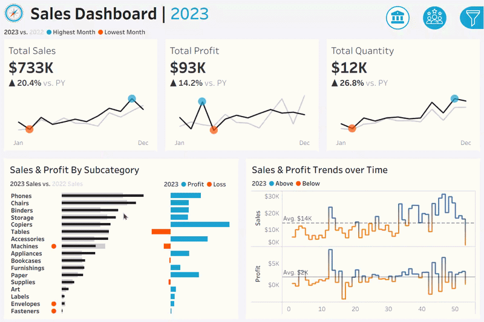

# Tableau Sales Dashboard Project

Welcome to the **Tableau Sales Dashboard Project** repository! 🚀  
This project contains two interactive dashboards (**Sales Dashboard** and **Customer Dashboard**) built with **Tableau** to analyze sales performance and customer behavior.

🎥 **Live Preview of Dashboards:**



> 🔗 **Interactive Dashboards on Tableau Public:**  
> [View and interact with the dashboards online](https://public.tableau.com/views/SalesCustomerDashboard_17808181350090/SalesDashboard?:language=en-US&publish=yes&:sid=&:redirect=auth&:display_count=n&:origin=viz_share_link) 

---

## 📖 Project Overview

This project focuses on delivering actionable insights for sales managers and marketing teams through two linked dashboards:

- **Sales Dashboard**: Tracks KPIs (Sales, Profit, Quantity), monthly trends, product subcategory performance, and weekly trends against averages.
- **Customer Dashboard**: Analyzes customer KPIs, monthly customer trends, customer distribution by orders, and top 10 customers by profit.

Both dashboards are **interactive**, allow **year selection**, and include **filters** for product and location data.

---

## 🎯 Requirements

The dashboards were built based on a detailed user story covering KPIs, trends, comparisons, and design interactivity.

📄 **Full user story available here:** [docs/user-story.md](docs/user-story.md)

---

## 📂 Repository Structure
```
tableau-sales-dashboard-project/
│
├── assets/
│ ├── icons/                         # Icons used in the dashboards
│ ├── mockups/                       # Design and container mockups
│ └── dashboard-preview.gif          # Animated preview of dashboards
│
├── datasets/                        # CSV files used in the dashboards
│
├── docs/
│ └── user-story.md                  # Complete requirements specification
│
├── LICENSE                          # License information for the repository
├── README.md                        # Project overview and instructions
└── Sales-Customer-Dashboard.twbx    # Packaged Tableau workbook

```


---

## 🙏 Acknowledgements

Thanks to [@datawithbaraa](https://www.youtube.com/@datawithbaraa) on YouTube for teaching me how to build these dashboards.

---

## 🛡️ License

This project is licensed under the [MIT License](LICENSE). You are free to use, modify, and share this project with proper attribution.

---

## 👨🏻‍💻 About Me

Hi there! I'm **Omid Zolfagahr Beigy**. I’m passionate about problem-solving and optimizing systems to enhance efficiency and performance. My core strengths lie in systems optimization, supported by skills in mathematical programming, data analysis, and machine learning.

Let's stay in touch! Feel free to connect with me on the following platforms:

[](https://linkedin.com/in/omidzbeigy)
[](https://public.tableau.com/app/profile/omid.zolfaghar.beigy/vizzes)
